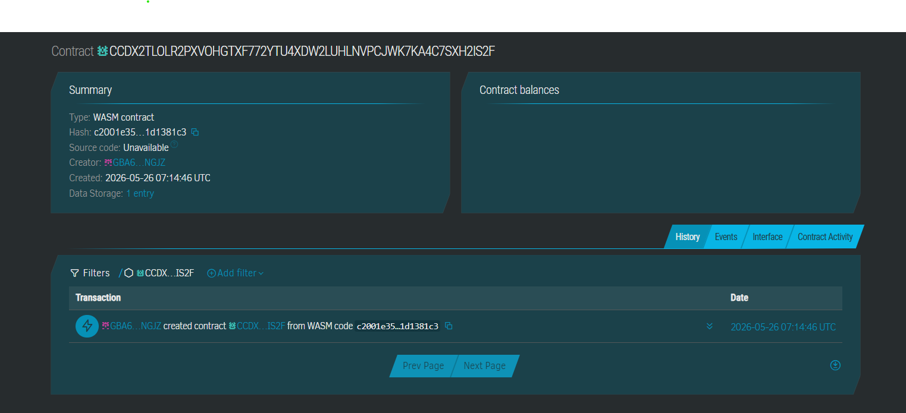

# 🛡️ GigGuard
## CONTRACT ID 
CCDX2TLOLR2PXVOHGTXF772YTU4XDW2LUHLNVPCJWK7KA4C7SXH2IS2F
## CONTRACT LINK 
https://stellar.expert/explorer/testnet/contract/CCDX2TLOLR2PXVOHGTXF772YTU4XDW2LUHLNVPCJWK7KA4C7SXH2IS2F




**Milestone-based escrow with 72-hour auto-release for freelancers on Stellar.**
> Client locks payment upfront. Freelancer delivers per milestone. If the client ghosts, funds auto-release after 72 hours. No middleman. 0.5% fee. Built on Stellar.
---
## 🔥 Problem
**Thanh**, a freelance web developer in **Ho Chi Minh City**, completed a **$500 website** for a Singapore-based client who then **ghosted him after delivery**. He has **no legal recourse** across borders, and the 3 previous escrow services he tried charged **8–15% fees** and took **2 weeks** to release funds.
**42% of SEA freelancers** report at least one non-payment incident per year.
## ✅ Solution
GigGuard is a **milestone-based escrow contract on Soroban** where clients **lock USDC upfront**, freelancers submit deliverables per milestone, and funds **auto-release after client approval** or after a **72-hour timeout** (preventing indefinite holds), all for a flat **0.5% fee**.
---
## 📅 Timeline
| Phase | Duration | Deliverable |
|-------|----------|-------------|
| **Sprint 1** | Days 1–3 | Soroban contract: `create_job`, `submit_milestone`, `approve_milestone` |
| **Sprint 2** | Days 4–6 | Timeout logic: `claim_timeout`, `dispute_milestone` + 5 tests |
| **Sprint 3** | Days 7–9 | Web frontend: job creation UI, milestone tracker, claim button |
| **Sprint 4** | Days 10–12 | Testnet deployment, demo video, pitch deck |
---
## ⭐ Stellar Features Used
| Feature | How It's Used |
|---------|---------------|
| **USDC Transfers** | Clients deposit USDC into escrow; freelancers receive USDC payouts |
| **Soroban Smart Contracts** | Escrow logic, milestone tracking, 72-hour timeout enforcement |
| **Built-in DEX** | Freelancer can swap USDC → XLM or local stablecoin instantly |
| **Trustlines** | USDC trustline required for freelancer wallet to receive funds |
| **Clawback / Compliance** | Dispute resolution mechanism for fraudulent submissions |
---
## 🎯 Vision & Purpose
GigGuard aims to become the **default payment layer for cross-border freelance work in Southeast Asia**. By combining Stellar's near-zero fees, 5-second settlement, and native USDC with milestone-based smart contract escrow, we eliminate the two biggest pain points for 1.5M+ SEA freelancers:
1. **Non-payment risk** → Funds locked before work starts
2. **Expensive intermediaries** → 0.5% vs 8–15% on traditional escrow
The 72-hour auto-release is our moat — it's a feature that **only works with smart contracts** and fundamentally changes the power dynamic between clients and freelancers.
---
## 🔄 Core Transaction Flow (MVP)
```
┌─────────────────────────────────────────────────────────────────┐
│                                                                 │
│  CLIENT                    CONTRACT                 FREELANCER  │
│                                                                 │
│  1. create_job($500) ──────► Lock $500 USDC                     │
│     (2 milestones x $250)   in escrow                           │
│                                                                 │
│                                          ◄── 2. submit_milestone│
│                             Record timestamp                    │
│                             Start 72hr clock ⏰                 │
│                                                                 │
│  3a. approve_milestone ───► Release $248.75 ────► 💰 Paid!      │
│      (client approves)      + $1.25 fee                         │
│                                                                 │
│  3b. (client ghosts) ──────► 72 HOURS PASS ⏰                   │
│                                          ◄── 4. claim_timeout   │
│                             Release $248.75 ────► 💰 Paid!      │
│                                                                 │
│  3c. dispute_milestone ───► Freeze milestone ❄️                  │
│      (client disputes)      (blocks timeout)                    │
│                                                                 │
└─────────────────────────────────────────────────────────────────┘
```
---
## 🛠️ Prerequisites
Before you begin, make sure you have the following installed:
| Tool | Version | Install |
|------|---------|---------|
| **Rust** | 1.79+ | [rustup.rs](https://rustup.rs/) |
| **Soroban CLI** | 22.0.0+ | `cargo install --locked stellar-cli --features opt` |
| **wasm32 target** | — | `rustup target add wasm32-unknown-unknown` |
| **Node.js** (optional, for frontend) | 18+ | [nodejs.org](https://nodejs.org/) |
---
## 🔨 How to Build
```bash
# Clone the repository
git clone https://github.com/your-org/gig-guard.git
cd gig-guard/contracts/gig_guard
# Build the Soroban contract to Wasm
stellar contract build
# The compiled Wasm will be at:
# target/wasm32-unknown-unknown/release/gig_guard.wasm
```
---
## 🧪 How to Test
```bash
# Run all 5 tests
cargo test
# Run tests with output
cargo test -- --nocapture
# Run a specific test
cargo test test_happy_path_create_submit_approve
```
### Test Coverage
| # | Test | What It Proves |
|---|------|----------------|
| 1 | `test_happy_path_create_submit_approve` | Full MVP flow works: create → submit → approve → freelancer paid |
| 2 | `test_unauthorized_approve_rejected` | Random address cannot approve milestones |
| 3 | `test_state_correct_after_job_creation` | All storage fields are correct after job creation |
| 4 | `test_timeout_auto_release_after_72_hours` | Freelancer can claim after 72hr timeout (anti-ghosting) |
| 5 | `test_dispute_blocks_timeout_claim` | Disputed milestones cannot be auto-claimed |
---
## 🚀 How to Deploy to Testnet
### 1. Configure Stellar CLI for Testnet
```bash
# Generate a new identity (or use existing)
stellar keys generate --global deployer --network testnet
# Fund the account via friendbot
stellar keys fund deployer --network testnet
```
### 2. Deploy the Contract
```bash
# Build first
stellar contract build
# Deploy to Stellar Testnet
stellar contract deploy \
  --wasm target/wasm32-unknown-unknown/release/gig_guard.wasm \
  --source deployer \
  --network testnet
```
Save the returned **Contract ID** (e.g., `CABC123...XYZ`).
### 3. Initialize the Contract
```bash
stellar contract invoke \
  --id <CONTRACT_ID> \
  --source deployer \
  --network testnet \
  -- \
  initialize \
  --fee_collector <YOUR_FEE_COLLECTOR_ADDRESS>
```
---
## 📞 Sample CLI Invocation (MVP Demo)
### Step 1: Client Creates a Job
```bash
stellar contract invoke \
  --id <CONTRACT_ID> \
  --source client \
  --network testnet \
  -- \
  create_job \
  --client <CLIENT_ADDRESS> \
  --freelancer <FREELANCER_ADDRESS> \
  --token <USDC_TOKEN_ADDRESS> \
  --milestone_amounts '[2500000000, 2500000000]' \
  --milestone_descriptions '["Homepage design", "Full website build"]'
```
### Step 2: Freelancer Submits Milestone 0
```bash
stellar contract invoke \
  --id <CONTRACT_ID> \
  --source freelancer \
  --network testnet \
  -- \
  submit_milestone \
  --freelancer <FREELANCER_ADDRESS> \
  --job_id 0 \
  --milestone_index 0
```
### Step 3: Client Approves (or wait 72 hours)
```bash
# Option A: Client approves
stellar contract invoke \
  --id <CONTRACT_ID> \
  --source client \
  --network testnet \
  -- \
  approve_milestone \
  --client <CLIENT_ADDRESS> \
  --job_id 0 \
  --milestone_index 0
# Option B: After 72 hours — freelancer claims timeout
stellar contract invoke \
  --id <CONTRACT_ID> \
  --source freelancer \
  --network testnet \
  -- \
  claim_timeout \
  --freelancer <FREELANCER_ADDRESS> \
  --job_id 0 \
  --milestone_index 0
```
### Step 4: Check Job Status
```bash
stellar contract invoke \
  --id <CONTRACT_ID> \
  --network testnet \
  -- \
  get_job \
  --job_id 0
```
---
## 📁 Project Structure
```
gig_guard/
├── contracts/
│   └── gig_guard/
│       ├── src/
│       │   ├── lib.rs      # Soroban smart contract (escrow logic)
│       │   └── test.rs     # 5 tests (happy path, edge case, state, timeout, dispute)
│       └── Cargo.toml      # Rust/Soroban dependencies
└── README.md               # This file
```
---
## 🏆 Why This Wins at a Hackathon
1. **Real money movement** — actual USDC flows through the contract, not fake tokens
2. **Solves a $15B problem** — freelancer non-payment is endemic in cross-border work
3. **The 72-hour auto-release** is a feature that ONLY works with smart contracts
4. **Culturally relevant** — built for SEA's 1.5M+ freelancer population
5. **Demo-able in 2 minutes** — create job → submit → approve/timeout → verify payment
---
## 📄 License
MIT License
Copyright (c) 2025 GigGuard
Permission is hereby granted, free of charge, to any person obtaining a copy
of this software and associated documentation files (the "Software"), to deal
in the Software without restriction, including without limitation the rights
to use, copy, modify, merge, publish, distribute, sublicense, and/or sell
copies of the Software, and to permit persons to whom the Software is
furnished to do so, subject to the following conditions:
The above copyright notice and this permission notice shall be included in all
copies or substantial portions of the Software.
THE SOFTWARE IS PROVIDED "AS IS", WITHOUT WARRANTY OF ANY KIND, EXPRESS OR
IMPLIED, INCLUDING BUT NOT LIMITED TO THE WARRANTIES OF MERCHANTABILITY,
FITNESS FOR A PARTICULAR PURPOSE AND NONINFRINGEMENT. IN NO EVENT SHALL THE
AUTHORS OR COPYRIGHT HOLDERS BE LIABLE FOR ANY CLAIM, DAMAGES OR OTHER
LIABILITY, WHETHER IN AN ACTION OF CONTRACT, TORT OR OTHERWISE, ARISING FROM,
OUT OF OR IN CONNECTION WITH THE SOFTWARE OR THE USE OR OTHER DEALINGS IN THE
SOFTWARE.
